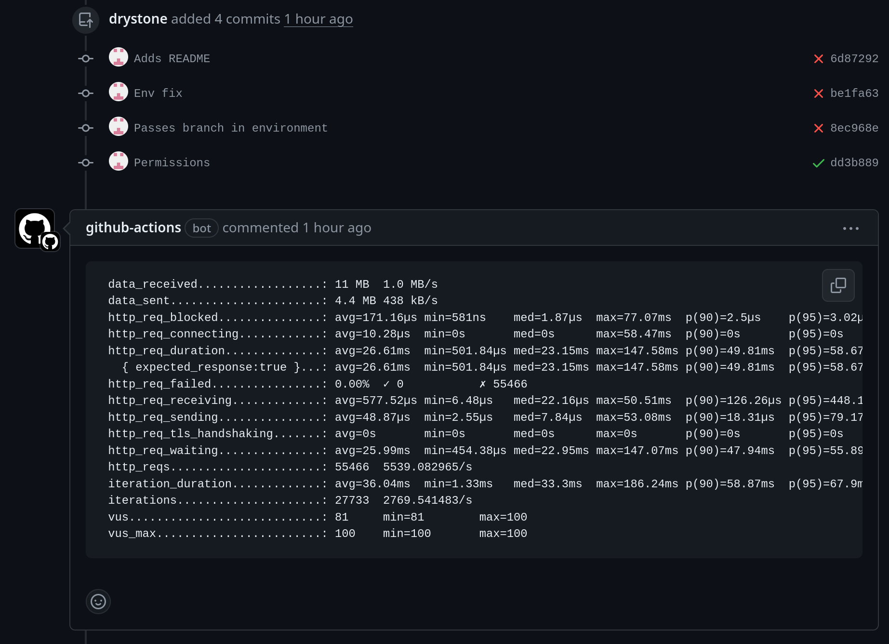

# Test Repo

This repository exists solely to develop a CI workflow. The requirements are to
run HTTP benchmarking tests for pull requests, and to post the test results as
a PR comment.

The CI comprises a single GitHub action to run the test itself and to post the
test results on success.

The test is written as a standalone [script](ci/foo-bar) that can be run
locally during development. It creates a [kind](https://kind.sigs.k8s.io/)
cluster with two [http-echo](https://github.com/hashicorp/http-echo)
deployments, and an nginx-ingress controller. Routing is configured to send
requests for `http://foo.localhost` to a service that responds `foo` and
`http://bar.localhost` to a service that responds `bar`. Once the services are
ready they are load tested with [k6](https://k6.io), results are output to a
file on the GitHub runner, and subsequently posted as a comment using [gh pr
comment](https://cli.github.com/manual/gh_pr_comment).

The foo and bar deployments share [service](ci/kustomize/base/service.yaml) and
[deployment](ci/kustomize/base/deployment.yaml) manifests; these are
["kustomized"](https://kustomize.io/) using
[kustomizations.yaml](ci/kustomize/overlays/all/kustomization.yaml).

The resulting comment looks something like this:

